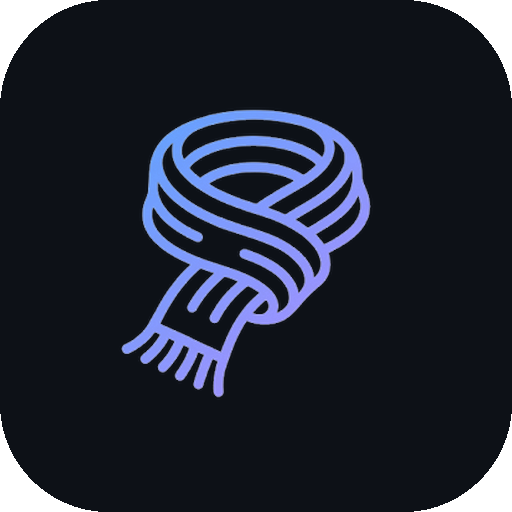
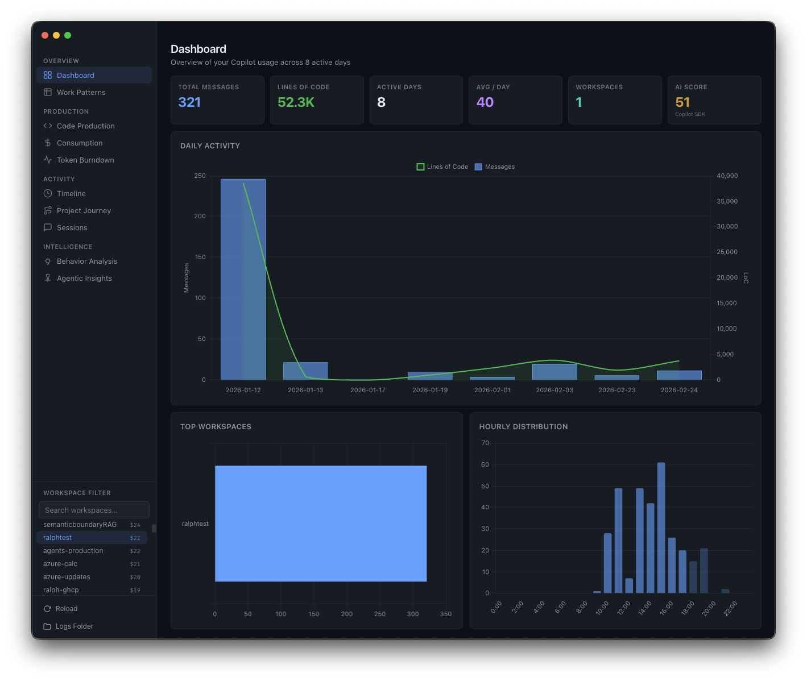

<div align="center">



# Orbit

**Are you actually good at agentic coding? Find out.**

[](https://www.electronjs.org/)
[](https://www.typescriptlang.org/)
[](LICENSE)
[]()

</div>

<br />

I keep getting asked: *"How do I become a better agentic developer?"* Most people have no idea how they actually use AI coding tools -- they've never measured it.

**Orbit fixes that.** It reads your local GitHub Copilot Chat logs from VS Code and runs 22 checks against your real usage data. No surveys. Just your actual behavior, analyzed.

<div align="center">

</div>

> **100% local. Read-only. Zero telemetry.**

---

## Why This Exists

Everyone talks about "prompting better" but nobody has data. Orbit gives you that data. It answers questions like:

- **Am I using the right model for the right task?** Bug fixes on GPT-4o-mini? Features on a deprecated model? Orbit flags it with specific sessions.
- **Am I giving the agent enough autonomy?** If the AI keeps saying "please run this command" and you keep copy-pasting, Orbit detects that pattern.
- **Am I wasting tokens on things a script could do?** Starting the dev server, running linters -- Orbit finds repeated simple prompts and tells you to automate them.
- **Is my context management hurting quality?** Long sessions degrade AI output. Orbit tracks session hygiene and tells you when to start fresh.
- **Am I using Copilot's full feature set?** Slash commands, file references, MCP servers, multi-agent delegation -- most developers use less than 30% of what's available.

---

## Quick Start

```bash
git clone https://github.com/aymenfurter/ghcp-orbit
cd ghcp-orbit
npm install
npm run dev
```

Orbit automatically discovers your Copilot Chat logs. No config needed.

For distribution builds: `npm run dist:mac`, `npm run dist:win`, `npm run dist:linux`.

---

## Privacy

All analytics run locally and in-memory. Orbit never modifies VS Code files. The optional Copilot SDK agent (the only feature that makes external calls) sends only aggregated stats -- never raw messages, code, or file paths -- and must be explicitly triggered.

---

<div align="center">

<sub>MIT License &nbsp;|&nbsp; Not affiliated with GitHub, Inc. or Microsoft Corporation</sub>

</div>
