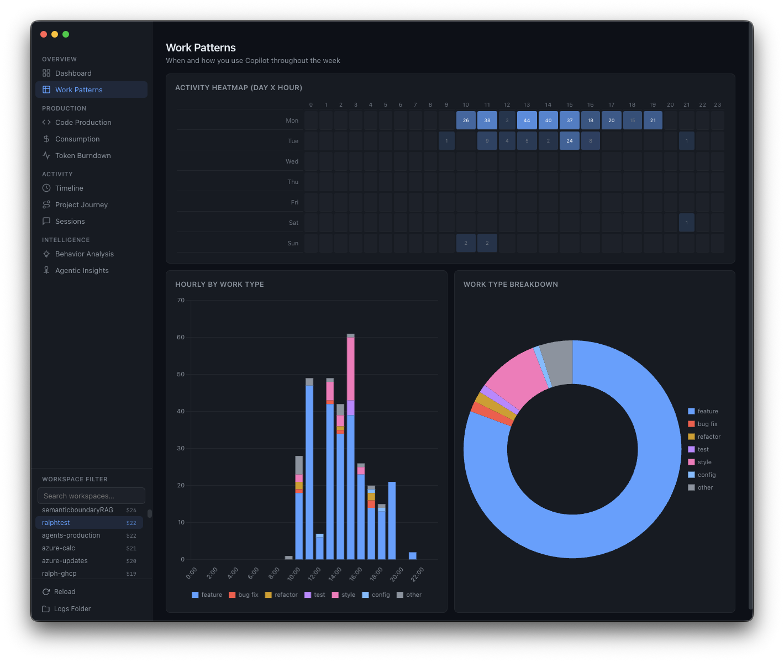
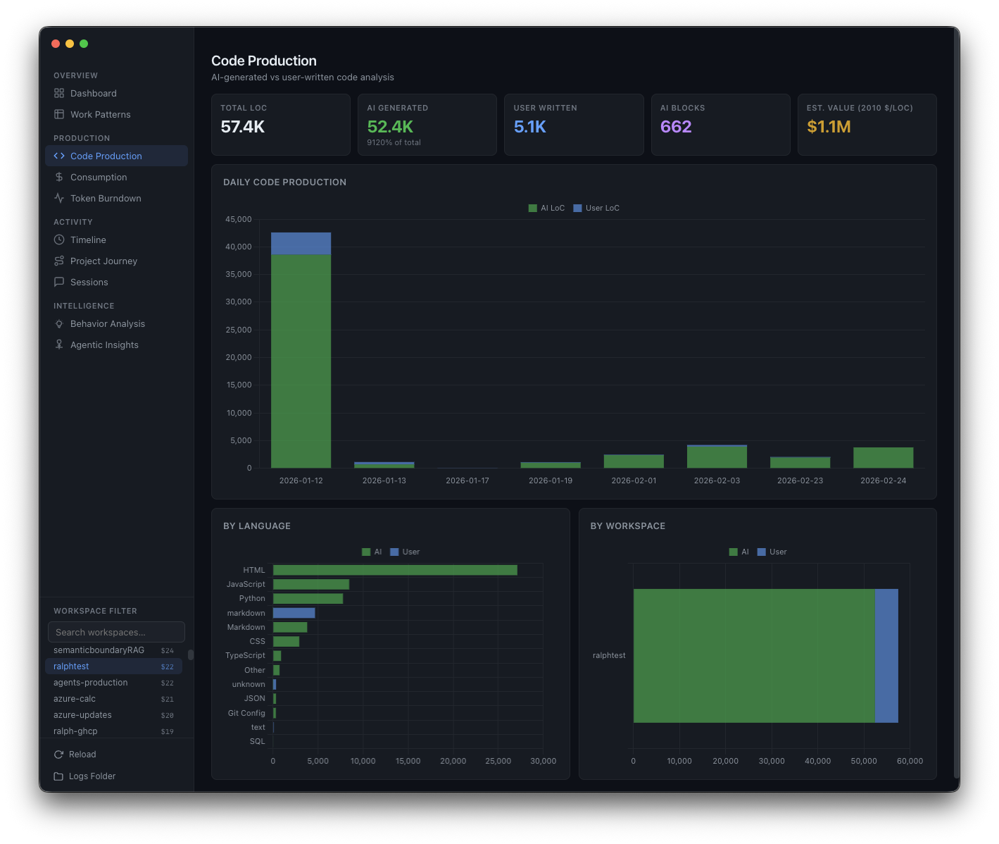
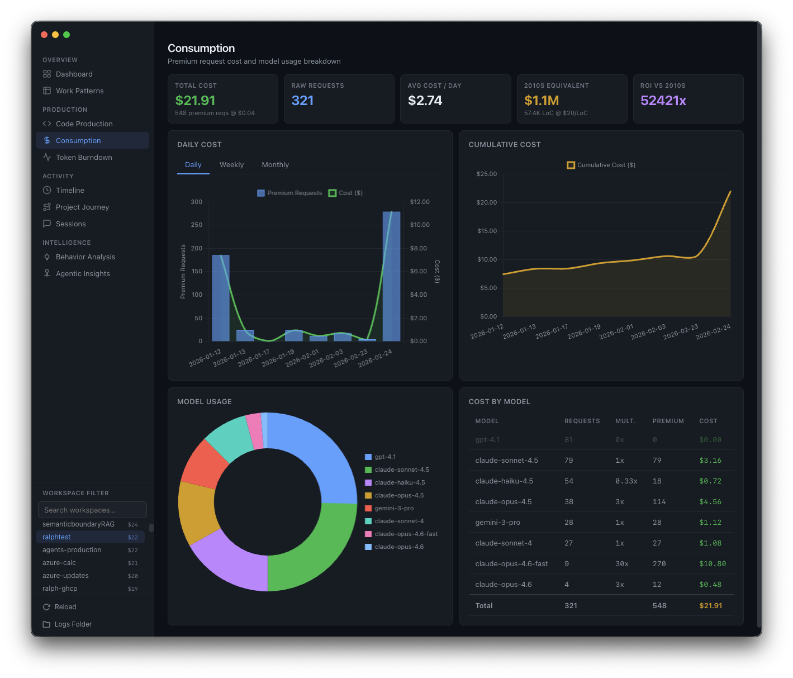
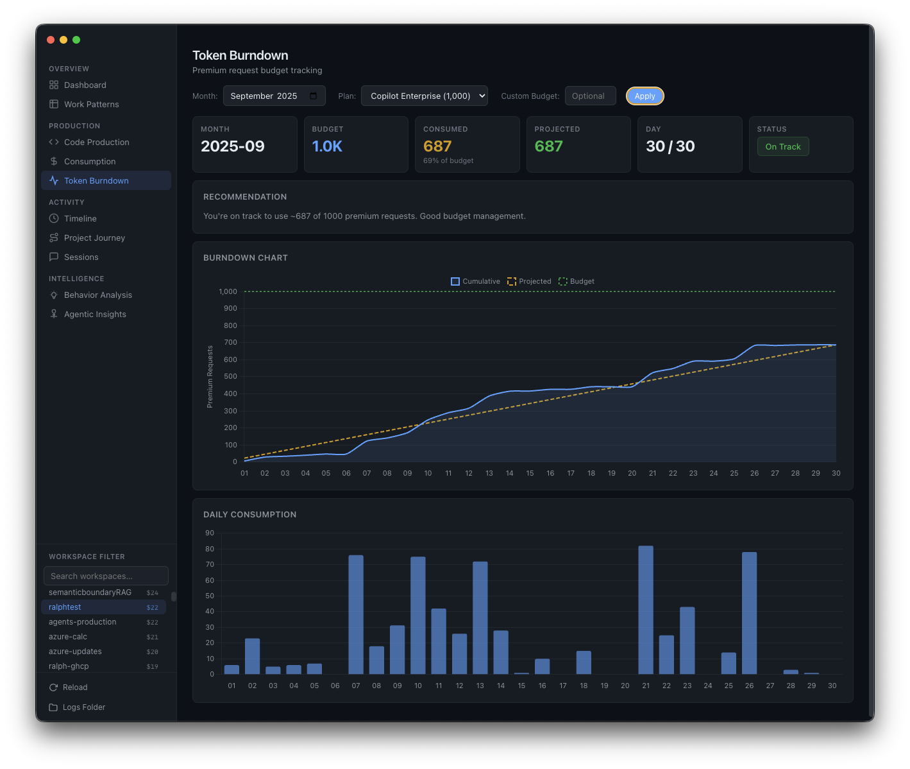
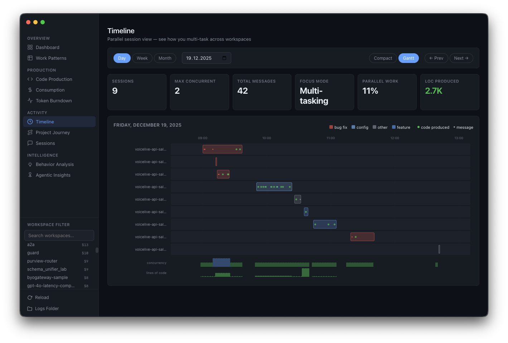
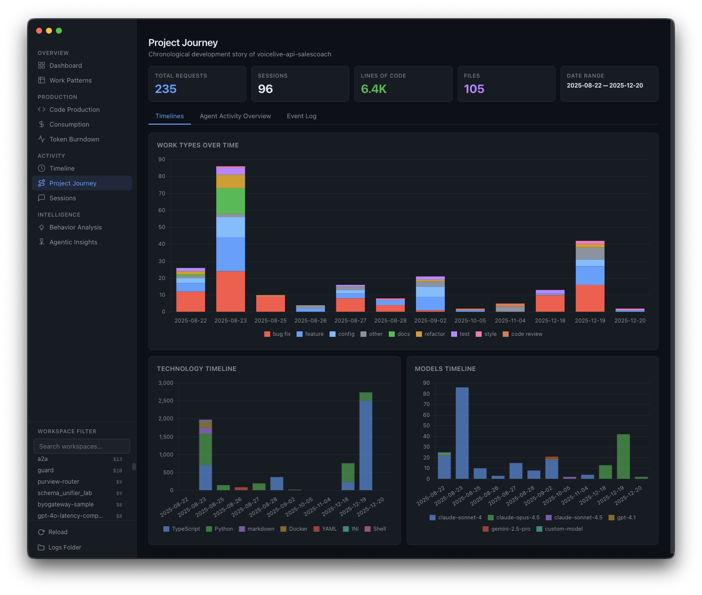
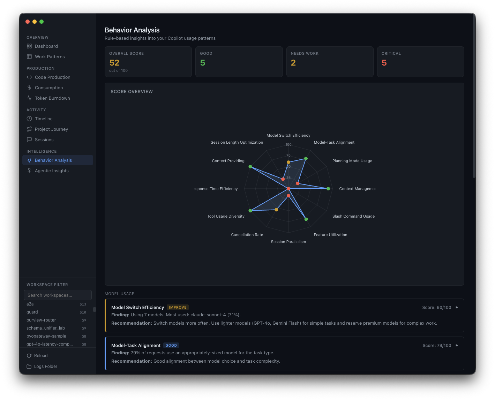
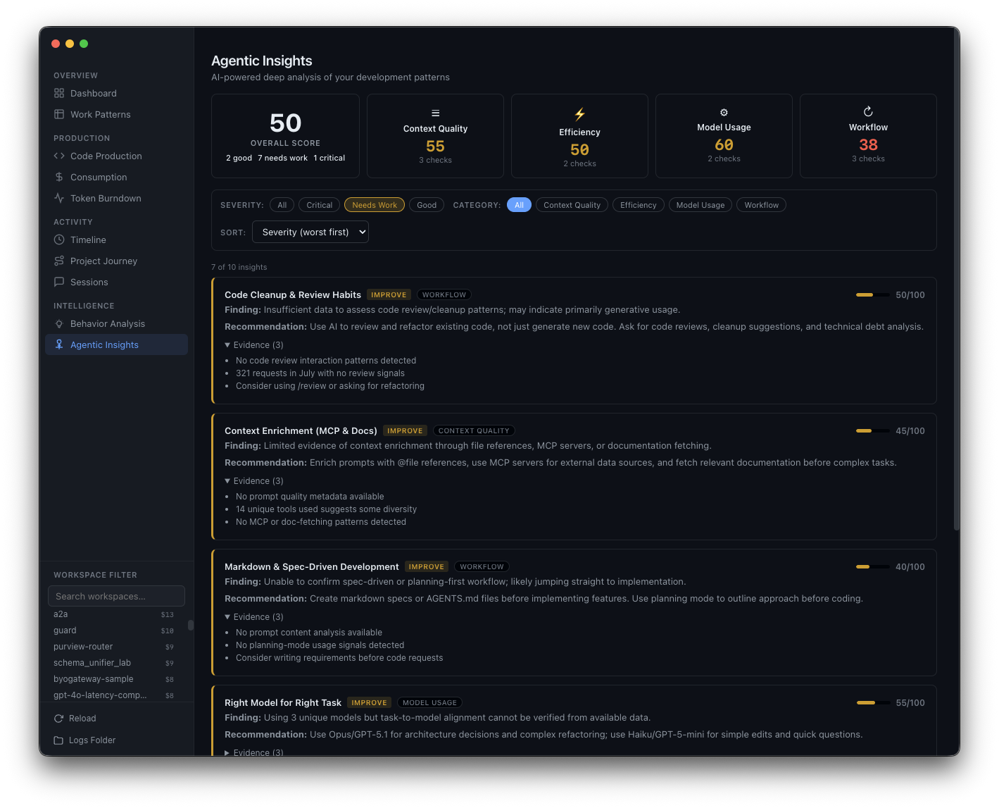

# GitHub Copilot Orbit Documentation

<div align="center">


**Development Intelligence Dashboard**

</div>

## Table of Contents

- [Overview](#overview)
- [Pages](#pages)
  - [Dashboard](#dashboard)
  - [Patterns](#patterns)
  - [Production](#production)
  - [Consumption](#consumption)
  - [Burndown](#burndown)
  - [Timeline](#timeline)
  - [Journey](#journey)
  - [Sessions](#sessions)
  - [Recommendations](#recommendations)
  - [Agentic Insights](#agentic-insights)
- [Architecture](#architecture)
- [Data and Parsing](#data-and-parsing)
- [Cost Model](#cost-model)
- [Privacy and Security](#privacy-and-security)
- [Platform Support](#platform-support)

---

## Overview

GitHub Copilot Orbit is a read-only, local-first desktop application that parses Copilot Chat session logs from VS Code's `workspaceStorage` directories (both Stable and Insiders editions). It surfaces usage patterns, productivity metrics, and cost analysis through a set of focused analytics pages.

GitHub Copilot Orbit never modifies or uploads your data. All analytics are computed locally and in-memory, with optional file-based caching for performance.

---

## Pages

### Dashboard


The main landing page showing key performance indicators at a glance:

- **Total sessions, messages, and code lines** generated across all workspaces
- **Daily activity chart** showing session and message volume over time
- **Top workspaces** ranked by activity
- **Hourly heatmap** revealing peak coding hours
- **Premium request cost** estimate based on model usage

### Patterns



Detailed analysis of when and how you use Copilot:

- **7x24 heatmap** -- a full week-by-hour grid showing activity density
- **Hourly work-type distribution** -- stacked visualization of what kind of work happens at each hour
- **Work-type breakdown** -- aggregate classification of sessions into feature development, bug fixes, refactoring, documentation, testing, and other categories

Work types are classified via deterministic regex matching on message content -- no LLM calls are used.

### Production



Quantitative view of code output:

- **AI vs user code** -- comparison of lines generated by Copilot versus lines written manually
- **Daily timeline** -- code production trends over time
- **Language breakdown** -- lines produced per programming language (aliases normalized: `ts` to `typescript`, `py` to `python`, etc.)
- **Workspace breakdown** -- production metrics per project

### Consumption



Cost tracking and model usage analysis:

- **Cost trends** -- daily, weekly, and monthly premium request costs
- **Model usage table** -- detailed breakdown of which models are used, how often, and at what cost
- **Cumulative tracking** -- running total of spend over time

Premium request cost is calculated at **$0.04 per request**, scaled by a per-model multiplier (0x--3x depending on model tier).

### Burndown



Monthly budget tracking for subscription plans:

- **Burndown chart** -- plots actual consumption against a linear projection, highlighting whether you are on track to exceed or underuse your monthly budget
- **Daily consumption bars** -- per-day premium request usage
- **Plan support** -- Pro, Pro+, Business, and Enterprise SKUs with configurable monthly budgets

### Timeline



Session concurrency visualization:

- **Swim-lane Gantt chart** -- each workspace gets a row, sessions are rendered as horizontal bars across time
- **Day/week/month modes** -- zoom in or out across different time scales
- **Concurrency analysis** -- sessions are bucketed into 1-minute intervals to derive max parallel sessions and focus mode percentage

### Journey



Per-workspace chronological narrative:

- **Work types** -- how the type of work evolved over time in each project
- **Tech stack** -- which languages and frameworks were used at each stage
- **Model adoption** -- how model usage changed over the project lifecycle

### Sessions

Paginated session list providing direct access to raw session data:

- **Session list** -- browse all sessions with filters for workspace, date range, and model
- **Message thread view** -- expand any session to see the full conversation, including user messages, assistant responses, and extracted code blocks
- **Metadata** -- timestamps, model used, turn count, and workspace association

### Recommendations



12 deterministic behavior checks, each producing a 0--100 score, severity level, and actionable tips. All checks run locally with no network calls:

| # | Check | ID | What it measures |
|---|---|---|---|
| 1 | Model Diversity | `model-switch` | Whether you explore different models |
| 2 | Model-Task Alignment | `model-task-align` | Whether model choice matches task complexity |
| 3 | Planning-First Usage | `planning-mode` | Whether you start sessions with planning prompts |
| 4 | Session Length Hygiene | `context-flush` | Flags mega-sessions with 50+ messages |
| 5 | Slash Command Adoption | `slash-commands` | Usage of built-in slash commands |
| 6 | Feature Breadth | `feature-usage` | Whether you use the full range of Copilot features |
| 7 | Parallelism | `parallelism` | Concurrent session usage patterns |
| 8 | Cancellation Rate | `cancellation` | How often responses are cancelled |
| 9 | Tool Diversity | `tool-diversity` | Range of tool calls used in sessions |
| 10 | Response Efficiency | `response-time` | Time spent waiting vs working |
| 11 | File Context Usage | `file-refs` | Whether file references are used for context |
| 12 | Session Size Distribution | `session-length` | Distribution of session lengths |

A **radar chart** provides a visual summary of all 12 dimensions.

### Agentic Insights



Optional AI-powered analysis using the `@github/copilot-sdk`:

- Requires GitHub authentication
- Sends only **aggregated statistics** -- never raw chat messages, code, or file paths
- Results are cached to disk with timestamps to avoid redundant analysis
- Provides deeper qualitative insights that go beyond what deterministic checks can surface

This feature is strictly opt-in. All core analytics work without it.

---

## Architecture

GitHub Copilot Orbit is built with **Electron** using strict security defaults:

- **Context isolation** enabled -- the renderer process has no direct access to Node.js APIs
- **Typed context bridge** -- all IPC between main and renderer goes through preload scripts with a typed API
- **Worker threads** -- log parsing runs off the main thread so the UI never freezes, with progress reported back via IPC events
- **esbuild** -- fast bundling targeting ES2022
- **Vanilla TypeScript** -- no UI framework in the renderer; Chart.js is the only visualization dependency

### Project Structure

```
src/
  main/           # Electron main process
    index.ts      # App entry, window management, IPC handlers
    parser.ts     # Log file discovery and parsing logic
    parse-worker.ts  # Worker thread for background parsing
    analyzer.ts   # Analytics computation
    agent.ts      # Copilot SDK integration
    types.ts      # Shared type definitions
  preload/
    index.ts      # Context bridge API
  renderer/
    app.ts        # Navigation, page routing, workspace filter
    index.html    # Shell HTML
    styles.css    # Dark theme styles
    pages/        # One module per page
```

---

## Data and Parsing

GitHub Copilot Orbit reads Copilot Chat session logs from VS Code's `workspaceStorage` directories. It supports two formats:

- **JSON** -- single-file session snapshots
- **JSONL** -- incremental records using kind markers:
  - `0` = init (session start)
  - `1` = set (full state replacement)
  - `2` = append (incremental update)

### Processing Pipeline

1. **Discovery** -- scan known VS Code storage paths for session files
2. **Parsing** -- extract sessions, messages, code blocks, and metadata
3. **Classification** -- categorize work types via regex on message content
4. **Normalization** -- consolidate model name variants (e.g., strip `-thought`, `-preview` suffixes)
5. **Caching** -- store parsed results using a SHA-256 fingerprint of directory structure and file modification times; invalidate automatically on any change

Code blocks are extracted using standard markdown fencing. Language aliases are mapped to canonical names (e.g., `ts` to `typescript`, `py` to `python`).

---

## Cost Model

GitHub Copilot Orbit estimates premium request costs using the following model:

- **Base cost**: $0.04 per premium request
- **Model multiplier**: 0x--3x depending on model tier
- **ROI baseline**: $20/LoC (2010s equivalent for comparison)
- **Burndown projection**: linear model based on daily consumption rate against monthly budget

Supported subscription tiers: Pro, Pro+, Business, and Enterprise.

---

## Privacy and Security

- **Local-only** -- no telemetry, no cloud sync, no external calls from core functionality
- **Read-only** -- GitHub Copilot Orbit never modifies or deletes VS Code log files
- **Sandboxed** -- Electron runs with `contextIsolation: true` and `nodeIntegration: false`
- **AI opt-in** -- the Copilot SDK agent is the only feature that communicates externally, and it sends only aggregated statistics (never raw messages, code, or file paths)

---

## Platform Support

GitHub Copilot Orbit discovers VS Code log directories on all major platforms:

| Platform | Paths |
|---|---|
| macOS | `~/Library/Application Support/Code/` and `Code - Insiders/` |
| Linux | `~/.config/Code/` and `Code - Insiders/` |
| Windows | `%APPDATA%/Code/` and `Code - Insiders/` |

All paths are normalized to forward slashes internally. `file://` URIs are decoded automatically.
